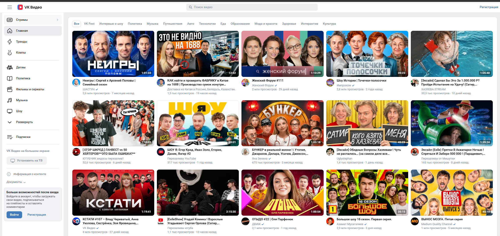
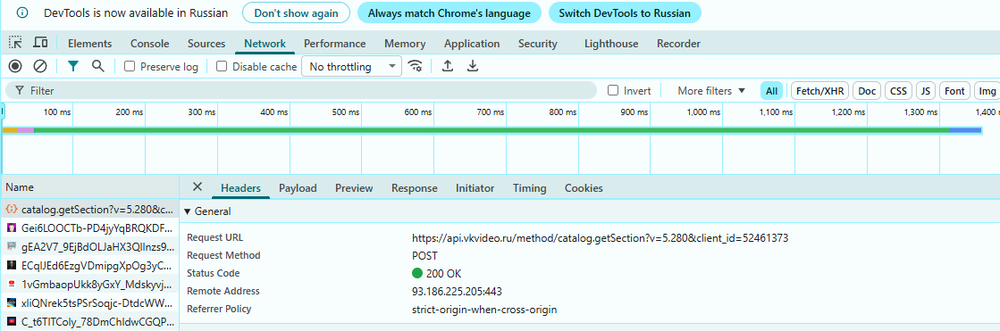
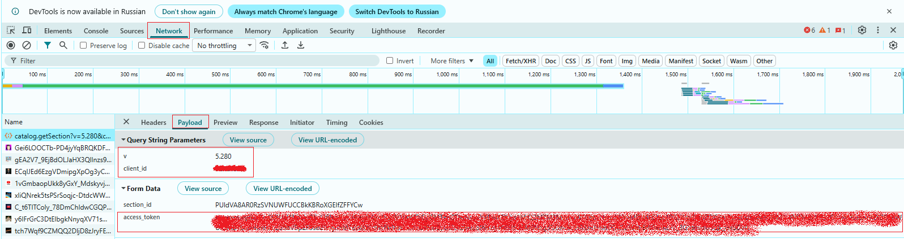
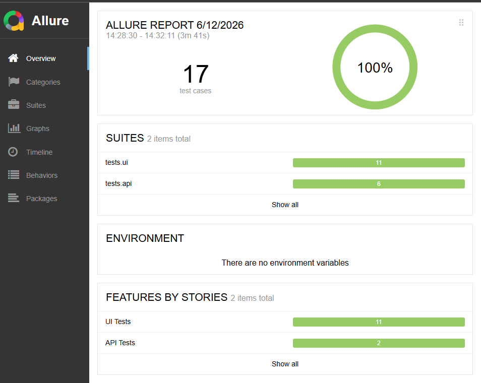
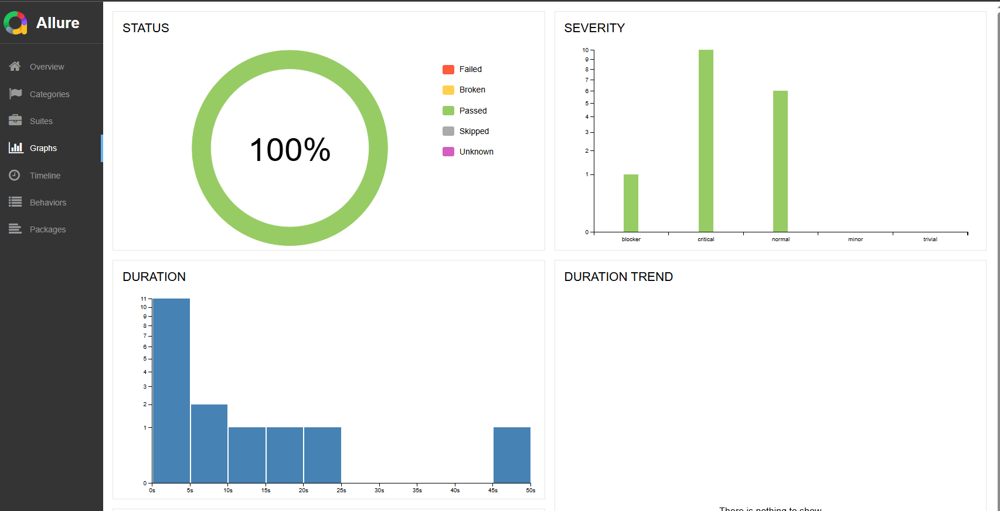
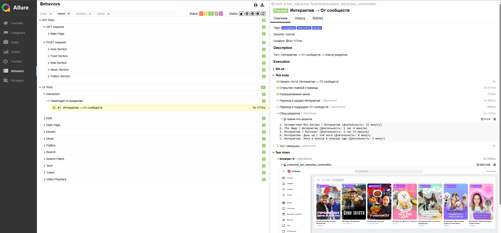

<h1> Проект Web и API тестирование видеоплатформы и стримингово сервиса VK Видео </h1>

----
> <code></code> <a target="_blank" href="https://vkvideo.ru/">VK Видео</a>



----
<!-- Технологии -->

## Проект реализован с использованием:
<p  align="center">
    <code></code>
    <code></code>
    <code></code>
    <code></code>
    <code></code>
    <code></code>
    <code></code>
    <code></code>
    <code></code>
    <code></code>
    <code></code>
</p>

----
<!-- Тест кейсы -->
UI (11):

* ✅ Проверка заголовка главной страницы
* ✅ Проверка breadcrumbs:
  * Подборка Технологии (+ инфо по первому видео)
  * Подборка Путешествия (+ инфо по первому видео)
* ✅ Проверка работы навигации:
  * Переход в раздел Музыка (+ инфо по первому видео)
  * Переход в раздел Детям → Развивашки (+ инфо по первому видео)
  * Переход в раздел Политика → Популярное (+ инфо по первому видео)
  * Переход в раздел Фильмы и сериалы → Фантастика (+ инфо по первому видео)
* ✅ Комбинированный тест навигация + breadcrumbs:
  * Отобразить скрытые разделы навигации: Развернуть → Интерактив → От сообществ (+ инфо по первым пяти интерактивам)
* ✅ Проверка работоспособности поисковой строки:
  * Поиск на примере 3х разных запросов (+ инфо по первому видео из каждого запроса)
  * Поиск по запросу и проверка работоспособности фильтров (+ инфо по первым пяти видео)
* ✅ Поиск видео по запросу → Воспроизведение видео → Проверка управления плеером с клавиатуры (+ инфо по видео)

 API (6):
* ✅ Получение ифнормации о главной странице
* ✅ Проверка breadcrumbs:
  * Подборка Еда (+ инфо по первым 10 видео)
  * Подборка Авто (+ инфо по первым 10 видео)
* ✅ Проверка работы навигации:
  * Переход в раздел Детям → Рекомендации (+ инфо по первым 10 видео)
  * Переход в раздел Музыка → Главные новинки (+ инфо по первым 5 видео)
  * Переход в раздел Политика →
      * Подпобка Шоу (+ инфо по первым 5 видео)
      * Подпобка Новости (+ инфо по первым 5 видео)
      * Подпобка Интервью (+ инфо по первым 5 видео)
      * Подпобка Популярное (+ инфо по первым 5 видео)
      * Подпобка Документальное (+ инфо по первым 5 видео)

<!--  -->

----
## Локальный запуск автотестов
> [!NOTE]
> Для запуска API тестов необходима предварительная настройка 


#### Открыть запрос выполнив переход по любой активной кнопке на Web интерфейсе `VK Видео` в режиме `DevTools (F12) → Network → Headers`

####  `Headers` должен содержать:
```bash
Request Method:   POST 
Status Code:      200 OK
```
#### 

#### Переключаемся в `Network` → `Payload`
#### 

#### Копируем ваши данные
```bash
V = "5.280" #Версия не критична, главное ее наличие
CLIENT_ID = "Ваш ID"
ACCESS_TOKEN = "Ваш TOKEN"
```
#### Их необходимо указать в файле конфигурации `tests → api → conftest.py`

----

### Рекомендуемые параметры запуска

```bash
>  pytest .\tests\ --alluredir=allure-results -v -s  
```

#### Для запуска с использованием `selenoid` изменить параметр запуска `USE_SELENOID` на `True`. По умолчанию стоит режим `False`.
> [!NOTE]
> Нет необходимости менять код!

#### Указывам перед запуском тестов из терминала
```bash
>  $env:USE_SELENOID="True"; pytest .\tests\ --alluredir=allure-results -v -s
```
### Построение Allure-отчета

```bash
>  allure generate allure-results -o allure-report --clean

>  allure open allure-report
```

### Перед повторным запуском выполнить
```bash
> Remove-Item -Recurse -Force allure-results, allure-report -ErrorAction SilentlyContinue
```
----
<!-- Allure report -->
#  Allure report

##### Результаты выполнения тестова можно посмотреть в Allure-отчете




----
<!-- Jenkins -->

###  Запуск проекта в Jenkins

### [Задача в jenkins](https://jenkins.autotests.cloud/job/Okko-reqres-project/)

----
<!-- Allure TestOps -->

###  Интеграция с Allure TestOps

### [Dashboard](https://allure.autotests.cloud/project/4221/dashboards)


----
<!-- Jira -->

###  Интеграция с Jira


----
<!-- Telegram -->

###  Оповещения в Telegram
##### После выполнения тестов, в Telegram bot приходит сообщение с графиком и информацией о тестовом прогоне.


